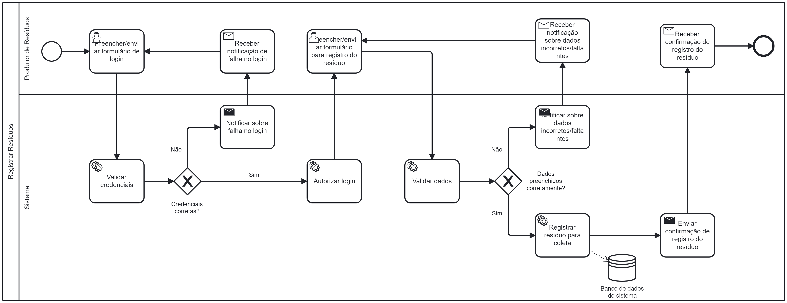

### 3.3.1 Processo 1 – Registrar Resíduos

Atualmente, o produtor de resíduos enfrenta dificuldades para coordenar a coleta dos recicláveis, pois não há um sistema estruturado para informar os locais e volumes de resíduos disponíveis. Muitas vezes, a comunicação sobre os pontos de coleta é feita de forma informal, através de contatos pessoais, ou de maneira aleatória. Isso pode resultar em atrasos e ineficiências na coleta dos materiais recicláveis.

No ReCiclo, o registro da demanda de resíduos otimizará o processo de coleta ao fornecer uma visão detalhada dos locais e volumes de resíduos. Com isso, tanto produtores quanto coletores irão se beneficiar de uma maior previsibilidade e eficiência, possibilitando um atendimento mais ágil às necessidades de coleta.

#### Detalhamento das atividades

_Descreva aqui cada uma das propriedades das atividades do processo 1. 
Devem estar relacionadas com o modelo de processo apresentado anteriormente._

_Os tipos de dados a serem utilizados são:_

_* **Área de texto** - campo texto de múltiplas linhas_

_* **Caixa de texto** - campo texto de uma linha_

_* **Número** - campo numérico_

_* **Data** - campo do tipo data (dd-mm-aaaa)_

_* **Hora** - campo do tipo hora (hh:mm:ss)_

_* **Data e Hora** - campo do tipo data e hora (dd-mm-aaaa, hh:mm:ss)_

_* **Imagem** - campo contendo uma imagem_

_* **Seleção única** - campo com várias opções de valores que são mutuamente exclusivas (tradicional radio button ou combobox)_

_* **Seleção múltipla** - campo com várias opções que podem ser selecionadas mutuamente (tradicional checkbox ou listbox)_

_* **Arquivo** - campo de upload de documento_

_* **Link** - campo que armazena uma URL_

_* **Tabela** - campo formado por uma matriz de valores_

**Nome da atividade 1**

| **Campo**       | **Tipo**         | **Restrições** | **Valor default** |
| ---             | ---              | ---            | ---               |
| [Nome do campo] | [tipo de dados]  |                |                   |
| ***Exemplo:***  |                  |                |                   |
| login           | Caixa de Texto   | formato de e-mail |                |
| senha           | Caixa de Texto   | mínimo de 8 caracteres |           |

| **Comandos**         |  **Destino**                   | **Tipo** |
| ---                  | ---                            | ---               |
| [Nome do botão/link] | Atividade/processo de destino  | (default/cancel  )|
| ***Exemplo:***       |                                |                   |
| entrar               | Fim do Processo 1              | default           |
| cadastrar            | Início do proceso de cadastro  |                   |

**Registrar resíduo(s) para coleta**

| **Campo**       | **Tipo**         | **Restrições** | **Valor default** |
| ---             | ---              | ---            | ---               |
| [Nome do campo] | [tipo de dados]  |                |                   |
|                 |                  |                |                   |

| **Comandos**         |  **Destino**                                 | **Tipo**          |
| ---------------------| ---------------------------------------------| ------------------|
| Registrar            | Publicar demanda de coleta do(s) resíduo(s)  | default           |
| Cancelar             | Página inicial                               | cancel            |
