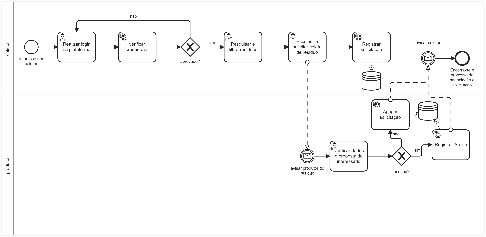

### 3.3.2 Processo 2 – Realizar Coleta

Para um coletor de resíduos sólidos realizar uma coleta ele deve, atualmente, identificar - seja através
de conhecidos, seja por mero acaso - os locais onde coletar os resíduos.
Nosso sistema busca melhorar o processo de identificação e coleta dos resíduos recicláveis, oferecendo ao
coletor uma lista de locais onde estão sendo oferecidos resíduos, colocando as partes de demanda e oferta
em contato e, então, registrando as interações entre as duas partes para a atualização do próprio sistema.

#### Detalhamento das atividades
**Login**
| **Campo**       | **Tipo**         | **Restrições** | **Valor default** |
| ---             | ---              | ---            | ---               |
| [Nome do campo] | [tipo de dados]  |                |                   |
| login           | Caixa de Texto   | formato de e-mail |                |
| senha           | Caixa de Texto   | mínimo de 8 caracteres |           |

| **Comandos**         |  **Destino**                   | **Tipo** |
| ---                  | ---                            | ---               |
| [Nome do botão/link] | Atividade/processo de destino  | (default/cancel  ) |
| entrar               | Início do processo de solicitar coleta | default           |
| cadastrar            | Início do proceso de cadastro  |                   |

**Solicitar Coleta**

| **Campo**       | **Tipo**         | **Restrições** | **Valor default** |
| ---             | ---              | ---            | ---               |
| [Nome do campo] | [tipo de dados]  |                |                   |
|       -         |        -         |       -        |       -           |

| **Comandos**         |  **Destino**                   | **Tipo**          |
| ---                  | ---                            | ---               |
| [Nome do botão/link] | Atividade/processo de destino  | (default/cancel/  ) |
|        Solicitar     | Fim do processo de solicitar coleta |  default |
