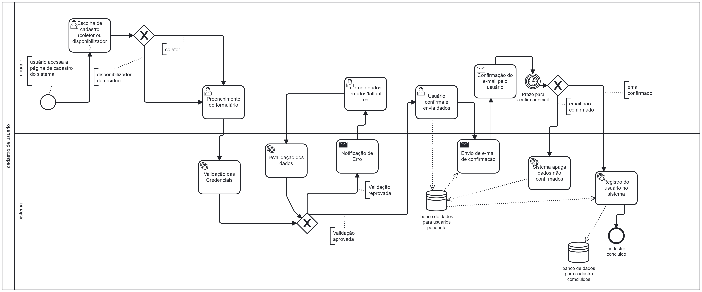

### 3.3.3 Processo 3 – Processo de Cadastro de Usuário

O diagrama apresenta o processo de cadastro de usuários em um sistema, focado em coleta ou disponibilização de resíduos. O usuário inicia acessando a página de cadastro, onde escolhe o tipo de cadastro e preenche o formulário com informações específicas. Após o preenchimento, o sistema valida as credenciais. Se houver erros ou dados faltantes, o usuário é solicitado a corrigir. Uma vez validado, um e-mail de confirmação é enviado ao usuário. Se o usuário confirmar o e-mail dentro do prazo estipulado, o cadastro é concluído e registrado no sistema. Caso contrário, os dados pendentes são apagados para manter a base de dados limpa e atualizada. Este processo garante uma coleta de informações segura e eficiente, essencial para a gestão adequada dos usuários envolvidos com resíduos.

#### Detalhamento das atividades

O processo ilustrado no diagrama detalha as etapas para o cadastro de usuários em um sistema digital, enfocando a coleta e disponibilização de resíduos. A jornada do usuário começa com o acesso à página de cadastro e a escolha do tipo de cadastro: como coletor ou disponibilizador de resíduo. O usuário então preenche um formulário com dados específicos ao tipo de cadastro selecionado. Esta etapa é crucial, pois as informações fornecidas são verificadas para autenticidade e precisão.

Uma vez submetido, o sistema executa uma validação das credenciais. Se as informações estiverem corretas, o processo segue; caso contrário, o sistema notifica o usuário para corrigir dados errados ou fornecer informações faltantes. Essa verificação é fundamental para manter a integridade e a segurança dos dados no sistema.

Após a aprovação da validação, o usuário é instruído a confirmar os dados por meio de um e-mail enviado pelo sistema. Este passo adiciona uma camada extra de segurança, assegurando que o endereço de e-mail fornecido é válido e que o usuário tem acesso a ele. O usuário precisa confirmar o cadastro através do link enviado dentro de um prazo definido. Se o usuário não confirmar o e-mail, o sistema automaticamente apaga os dados pendentes do banco de dados, o que ajuda a manter a base de dados limpa e atualizada.

Finalmente, uma vez que o e-mail é confirmado, o cadastro do usuário é concluído e seus dados são armazenados no banco de dados de cadastros concluídos. Este processo não só facilita a organização e a administração eficiente dos usuários mas também assegura que todas as informações sejam coletadas e verificadas de forma sistemática, reduzindo erros e garantindo a conformidade com as normas de segurança de dados.

Este fluxo de cadastro é exemplar para sistemas que requerem uma alta confiabilidade nas informações dos usuários, especialmente em contextos que lidam com gestão de resíduos, onde a precisão e a confiabilidade são críticas.
