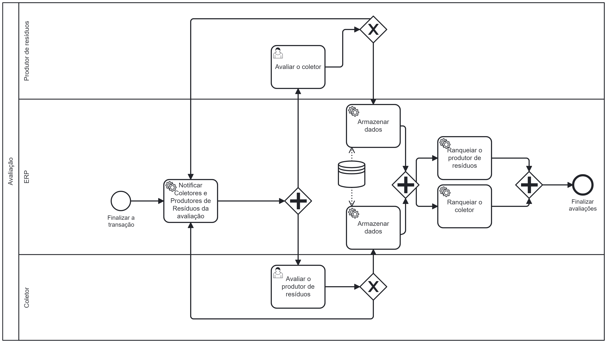

### 3.3.4 Processo 4 – Avaliação

Durante a fase de avaliação será possível que os Coletores avaliem como foi sua experiência com os produtores de resíduos e os produtores de resíduos poderão dar seu feedback do trabalho prestado pelos coletores. A avaliação mútua é fundamental para mantermos um Quality Assurance da plataforma. Através dos dados coletados nas avaliações, o sistema ranqueará os coletores melhores avaliados, bem como, os melhores fornecedores de resíduos. Este processo promove a confiança no serviço e ajuda na tomada de decisão dos novos usuários.

#### Detalhamento das atividades

Após a finalização da transação entre ambas as partes, o sistema irá notficá-los que existe uma pendência. Ao entrar no sistema, os produtores de resíduos serão recebidos com uma tela para fornecer a avaliação dos coletores, e os coletores receberam uma tela para avaliar os produtores. Após a conclusão da etapa anterior, os dados serão armazenados no banco de dados do sistema, onde cada usuário terá seu ranking de avaliação sendo calculado através de uma média simples entre número de avaliações e valor avaliado. Os valores coletados serão utilizados no ranqueamento e filtragem descrito nos processos anteriores.
